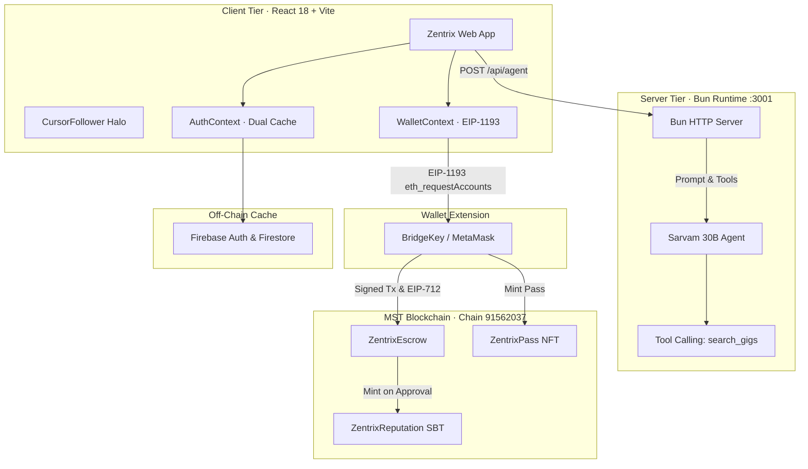

# Zentrix — Complete Application Context & Technical Specification

> **Repository:** Zentrix (`Precise-Goals/Strivo`)  
> **Blockchain:** MST Testnet (Chain ID `91562037`)  
> **Status:** Production-Ready Testnet Prototype (All 6 Gates Passing)  
> **Last Updated:** September 2026

---

## 1. Project Overview & Vision

**Zentrix** is a decentralized, non-custodial freelance marketplace built natively on the **MST Blockchain** for the **MST Blockchain × NEWRRO Buildathon 2026** (BMS College of Engineering, Bengaluru).

### Core Value Proposition
- **0% Platform Commission:** 100% of agreed funds flow directly from client to freelancer without platform rent-seeking.
- **Smart Contract Escrow:** Non-custodial, milestone-gated fund custody on MST Testnet using OpenZeppelin v5 contracts with pull-payment withdrawals and reentrancy protection.
- **Dual Digital Signature Disclosures:** EIP-712 structured data digital signatures anchor legal disclosure agreements immutably on-chain during gig creation and freelancer acceptance.
- **72-Hour Auto-Release Invariant:** If a client goes unresponsive after milestone delivery, funds unlock automatically, eliminating payment anxiety.
- **Soulbound Reputation Tokens (SBTs):** Non-transferable ERC-721 tokens minted upon milestone approval, creating a portable cryptographic proof of work.
- **Sarvam 30B AI Matchmaker:** Server-side tool-calling AI agent using `sarvam-30b` that scores tech stack alignment without exposing personal identifiable information (PII).
- **ZentrixPass NFTs:** Tiered access passes (Scout, Builder, Architect) providing daily AI query quotas, rendered dynamically in grayscale when unowned and full color when active.

---

## 2. Hard Invariants & Rules

1. **Testnet Only (Chain ID 91562037):** Never deploy to or touch mainnet or chain 4646.
2. **Zero Secrets in Git/Logs:** Secrets live exclusively in `.env.local`. Verified via `scripts/check-secrets.sh`.
3. **Chain as Source of Truth:** Money, escrow custody, milestone approval, reputation, and NFT pass tiers live on the MST Blockchain. Firebase handles off-chain caching, profile indexing, and search.
4. **Zero PII on Chain:** Names, emails, and phone numbers are never stored on-chain or fed to the AI model. Composed in compliance with India's **Digital Personal Data Protection (DPDP) Act 2023**.
5. **AI Model Isolation:** Provider is Sarvam `sarvam-30b`, executed strictly on the Bun backend server. Never called from client browser code. Never use `sarvam-m`.
6. **Design Tokens Compliance:** All visual styling strictly consumes tokens from `src/styles/tokens.css` (`#A30402`, `#F7F7F7`, `#000000`, and derived tokens). Zero raw 6-digit hex outside `tokens.css`.
7. **Solidity Best Practices:** `^0.8.20`, OpenZeppelin v5, custom errors, checks-effects-interactions, pull payments via `withdrawable(address)`, `nonReentrant` on value transfers, events emitted on every state transition.
8. **Transaction UX Feedback:** Every on-chain mutation displays Pending $\rightarrow$ Confirmed $\rightarrow$ MSTScan Explorer Link. Every data list provides designed empty, loading, and error states.
9. **Role Shifting Invariant:** Casual role switching in navbars and headers is strictly disabled. Role modification is restricted to Profile Settings to prevent accidental mode switches.
10. **Immutable Milestone Approvals:** Once a milestone is marked `Approved` by the client or mentor, it is permanently locked and non-reversible.

---

## 3. MST Blockchain Network Parameters & Contracts

### 3.1 Network Facts
- **Network Name:** MST Testnet
- **Chain ID:** `91562037` (`0x5752035`)
- **Native Currency:** `tMSTC` (18 decimals)
- **RPC Endpoint:** `https://testnetrpc.mstblockchain.com`
- **Block Explorer:** `https://testnet.mstscan.com`
- **Wallet Support:** BridgeKey (official Chrome extension) & MetaMask (EIP-1193 standard)

### 3.2 Deployed Smart Contracts

| Contract Name | Deployed Address | Standard | Core Responsibility |
|---|---|---|---|
| **ZentrixEscrow** | `0xa50759E9CE985Fbb06503CaeC0DB9D1fB1233726` | Custom OZ v5 | Milestone-gated fund custody, pull withdrawals, 72h auto-release, dispute arbitration |
| **ZentrixReputation** | `0xB224Bd880326a5046F8526461d25fa5217636cA3` | ERC-721 Soulbound | Non-transferable credentials minted on milestone completion |
| **ZentrixPass** | `0xE33932ba495ff04b321a2c7E58C34b43A7Ff2e9b` | ERC-721 Soulbound | Tiered access passes (Tier 1: Scout, Tier 2: Builder, Tier 3: Architect) |

### 3.3 Verified On-Chain Transactions
- `0x03f4a7c32f86c9eb639ad210070c1555bf88133b7ab4957160531828956650e0`
- `0x24feec36f0bf14315aad3a89ab43b101f741d3789d9c7b62c135c4217d484014`

---

## 4. System Architecture & Topology



---

## 5. Frontend Pages & Features

| Route | Component | Key Features & Implementation |
|---|---|---|
| `/` | `src/pages/Home.tsx` | Hero banner with luxury typography, centered Marketplace CTA, interactive Bento features, Web2 vs Web3 comparative breakdown, escrow lifecycle infographic, and client/freelancer FAQs. |
| `/marketplace` | `src/pages/Marketplace.tsx` | Comprehensive gig feed, category filters (Development, Design, AI, Security), budget & duration sorting, instant BridgeKey connect modal, and transparent on-chain agreement badges. |
| `/agent` | `src/pages/Agent.tsx` | Sarvam 30B conversational matchmaker. Renders user prompts, AI replies, tool-call execution badges, and recommended gig cards with live match scores. Zero browser LLM calls. |
| `/dashboard` | `src/pages/Dashboard.tsx` | Escrow balance metric, ZentrixPass visualizer (grayscale when unowned, full-color when active), interactive milestone submissions for freelancers, permanent non-reversible milestone approvals for clients/mentors, pull withdrawals, and SBT gallery. |
| `/pricing` | `src/pages/Pricing.tsx` | 3-column bento pricing cards for Scout, Builder, and Architect passes. Top showcase features active minted Pass NFT. Real on-chain pricing read via `tierPrices()`, dynamic `buy()` call with MSTScan tx link. Pro Pass (`1.gif`) and Enterprise Pass (`2.gif`) render in grayscale with unlock states. |
| `/profile` | `src/pages/Profile.tsx` | Identity Space bento layout. Encoded base64 avatar upload with client-side canvas compression, choosable craft tags (up to 10), and restricted **Account Role Mode** switcher inside Edit Profile modal. |
| `/about` | `src/pages/About.tsx` | Technical architecture displayed in a dense, balanced 2×2 grid (Firebase, MST Chain, Sarvam AI, BridgeKey) with zero blank gaps. Network parameter table, deployed contract cards, and centered Mission & Philosophy section. |
| `/disclosure` | `src/pages/Disclosure.tsx` | Comprehensive legal disclosures covering Freelancer Agreement, Client Terms, Platform Governance, Escrow Release Rules, Dispute Arbitration, and Indian IT Act 2000 §10A digital signature disclosure. |
| `/onboarding` | `src/pages/Onboarding.tsx` | Progressive Discord-style step-by-step questionnaire with fade-up transitions, role selection, skill tag picker, and wallet binding. |

---

## 6. Key Components & Utilities

### 6.1 `src/components/Navbar.tsx`
- Centered minimal aesthetic with glassmorphism backdrop blur.
- Dropdown menus: "Services" (Marketplace & AI Matchmaker) and "Monitor" (Pricing & Dashboard).
- Legal & Escrow and About direct links.
- Connect Wallet trigger: shows truncated address pill with green indicator when connected.
- Profile Dropdown: Displays user avatar/initials, connected address, read-only locked role status badge, and direct link to Profile Settings.

### 6.2 `src/components/CursorFollower.tsx`
- Non-occluding interactive halo follower.
- On hover over buttons, links, or inputs:
  - Outer ring expands to a subtle, transparent framing halo (`background: transparent`, `pointer-events-none`).
  - `backdropFilter: none` ensures button text is never blurred or distorted.
  - Precision core dot shrinks and softens opacity so text remains 100% legible.
- Trailing lerp easing (`ease = 0.15`) delivers a silky, elastic Dribbble-style trailing physics.

### 6.3 `src/context/WalletContext.tsx`
- Pre-hydrates wallet state synchronously from `localStorage` (`zx_connected_address`, `zx_connected_type`, `zx_wallet_approved`).
- Silent background reconnection via `eth_accounts` on page reload without prompting the user or causing error code 4100 (superseded connection request).
- Auto-prompts network switch to MST Testnet (Chain `91562037`) if connected to an incorrect network.

### 6.4 `src/context/AuthContext.tsx`
- Persists user profile, display name, avatar, and active role across sessions.
- Pre-hydrates directly on mount from `zx_cached_role` and `zx_cached_profile`.
- Synchronizes with Firebase Auth and Firestore.

### 6.5 Route Protection & Access Control (`src/App.tsx`)
- **Protected Routes (`ProtectedRoute`):** Strict authentication guard on core operational portals:
  - `/marketplace`: Milestone gig listings and applications
  - `/agent`: Sarvam 30B talent search agent
  - `/dashboard`: Milestone escrow telemetry and withdrawals
  - `/profile`: User role management and identity settings
- **Public Routes:** Accessible to all visitors without requiring authentication:
  - `/`: Protocol landing page
  - `/pricing`: ZentrixPass tier pricing & pass NFT purchasing
  - `/about`: Network parameters & technical architecture
  - `/manual`: Comprehensive protocol user manual
  - `/contact`: Direct sync inquiry desk
  - `/disclosure`: Legal terms & digital signature specifications
  - `/login`: Web3 & Firebase authentication portal
  - `/onboarding`: Progressive role & profile setup

### 6.6 Authentication & Sequential Onboarding Architecture (`src/pages/Login.tsx` & `src/pages/Onboarding.tsx`)
- **Strict Identity Authentication (`/login`):**
  - Ambient glowing glassmorphic card with protocol trust pills (non-custodial escrow, MST Testnet 91562037, DPDP 2023 compliance).
  - Authenticates strictly via Firebase: 1-Click Google OAuth or Email/Password credentials (no direct wallet connection bypass).
  - Upon authentication, automatically routes un-onboarded users directly into `/onboarding` (preserving any intended `from` destination).
- **Sequential Protocol Onboarding Wizard (`/onboarding`):**
  - Step 1: Role & Realm Selection (Creator / Freelancer vs Hirer / Client)
  - Step 2: Profile Identity & Avatar Canvas Encoder
  - Step 3: Interactive Craft Tag Selection
  - Step 4: Engagement Preferences & Rates
  - **Step 5 (Final Section): Web3 Wallet Anchor & Cryptographic Binding**
    - Connects BridgeKey or EVM wallet to MST Testnet (Chain ID `91562037`).
    - Requests an EIP-191 binding signature confirming identity ownership.
    - Saves profile to Firebase Realtime Database and local storage, activating `isOnboarded: true` and routing seamlessly to target destination.
- **ZentrixPass Tier Representation:**
  - On-chain and cached asset scanning via `scanNFTAssets()` and `getCachedNFTAssets()`.
  - **Tier 0 (Free):** 2 Sarvam queries/day, `/1.gif` rendered in grayscale with lock badge.
  - **Tier 1 (PRO):** 10 Sarvam queries/day, `/1.gif` rendered in full color with PRO badge.
  - **Tier 2 (Enterprise):** 15 Sarvam queries/day, `/2.gif` rendered in full color with ENT badge.
  - Rate limiting enforced on the Bun backend server (`server/index.ts`).

---

## 7. Digital Signature Disclosure Protocol (`docs/ONCHAIN_DISCLOSURE_SIGNATURES.md`)

1. **Document Canonicalization:** The project agreement, milestones, IP assignment, and escrow release conditions are compiled into a canonical JSON structure.
2. **Digest Hashing:** Keccak-256 hash produces a 32-byte `agreementHash`.
3. **EIP-712 Dual Signatures:**
   - **Client:** Signs `ClientGigDisclosure` struct via BridgeKey when funding the gig on MST Testnet.
   - **Freelancer:** Signs `FreelancerAcceptanceDisclosure` struct via BridgeKey when accepting the gig.
4. **On-Chain Non-Repudiation:** Verified in `ZentrixEscrow` via OpenZeppelin's `ECDSA.recover`.
5. **Legal Enforceability:** Meets legal standards under **Section 10A of the Indian Information Technology Act, 2000** for electronic contract validity.

---

## 8. Verification & Gate Scripts

The codebase is protected by automated verification gates defined in `scripts/gate.sh`:

```bash
# Run all gates simultaneously
bash scripts/gate.sh all

# Sub-gates:
bash scripts/gate.sh env        # Validates MST Testnet RPC connection & faucet balances
bash scripts/gate.sh contracts  # Executes 15 Hardhat contract unit tests
bash scripts/gate.sh web        # Runs Vite production build & TypeScript typechecks
bash scripts/gate.sh secrets    # Scans for exposed private keys or credentials
bash scripts/gate.sh theme      # Enforces theme token compliance (zero raw hex)
bash scripts/gate.sh proof      # Verifies on-chain contract bytecode on MST Testnet
```

### Last Verification Result:
- `env PASS`
- `contracts PASS` (15/15 tests passing)
- `web PASS` (Vite build in 7.17s)
- `secrets PASS`
- `theme PASS`
- `proof PASS` (All 3 contracts verified on MST Testnet)

---

## 9. Repository Structure

```
Zentrix/
├── contracts/
│   ├── ZentrixEscrow.sol          # Milestone escrow, pull payments, 72h auto-release
│   ├── ZentrixReputation.sol      # Soulbound ERC-721 credential tokens
│   └── ZentrixPass.sol            # Soulbound ERC-721 access passes (Tiers 1-3)
├── DOCS/
│   ├── CONTEXT.md                 # Complete application context & safeguarding record
│   ├── Concept.md                 # Product conceptual framework & milestone mechanics
│   ├── Frontend.md                # UI architecture & state management specifications
│   ├── Harness.md                 # Master buildathon harness specification
│   ├── MST_FACTS.md               # MST Testnet canonical technical reference
│   ├── ONCHAIN_DISCLOSURE_SIGNATURES.md # Digital signature & disclosure architecture
│   ├── PROOF.md                   # On-chain contract verification record
│   └── AUDIT.md                   # Security audit checklist
├── public/
│   ├── 1.gif                      # Pro Pass NFT visual asset
│   ├── 2.gif                      # Enterprise Pass NFT visual asset
│   ├── robot.png                  # Sarvam AI mascot brand asset
│   ├── logo.png                   # Brand mark
│   ├── navlogo.png                # Horizontal navbar emblem
│   ├── footlogo.png               # High-contrast footer logo
│   ├── sitemap.xml                # Comprehensive XML sitemap for search indexing
│   └── robots.txt                 # Search engine crawler policies
├── scripts/
│   ├── gate.sh                    # Master verification gate runner
│   ├── check-secrets.sh           # Secret leak scanner
│   ├── check-theme.sh             # Raw hex color scanner
│   ├── check-chain-proof.ts       # On-chain contract bytecode verifier
│   └── fund_wallets.ts            # Testnet faucet funding utility
├── server/
│   └── index.ts                   # Bun backend server (:3001) for Sarvam 30B (Tiers 0:2, 1:10, 2:15)
├── src/
│   ├── components/
│   │   ├── Navbar.tsx             # Centered glassmorphic navbar with Services, Monitor & Support dropdowns
│   │   ├── Footer.tsx             # Clean minimal footer with Support and Protocol links
│   │   ├── CursorFollower.tsx     # Non-occluding halo framing cursor with dribble lerp
│   │   ├── ConnectWalletModal.tsx # BridgeKey & MetaMask connection modal
│   │   └── EscrowFlowInfographic.tsx # Interactive escrow lifecycle visualizer
│   ├── context/
│   │   ├── WalletContext.tsx      # EIP-1193 provider & auto-reconnect engine
│   │   └── AuthContext.tsx        # Firebase auth & identity state persistence
│   ├── lib/
│   │   ├── firebase.ts            # Firebase Auth, Firestore, and Realtime Database (rtdb) client
│   │   └── nftScanner.ts          # On-chain NFT scanner for ZentrixPass and ZentrixReputation
│   ├── pages/
│   │   ├── Home.tsx               # Landing page & marketplace gateway
│   │   ├── Marketplace.tsx        # Live gig board & filter matrix
│   │   ├── Agent.tsx              # Sarvam 30B conversational matchmaker with clickable gig/freelancer cards
│   │   ├── Dashboard.tsx          # Interactive milestone management & pull withdrawals
│   │   ├── Pricing.tsx            # Pass NFT tiers with grayscale/color states (Pro: 10/day, Ent: 15/day)
│   │   ├── Profile.tsx            # Identity Space bento & role configuration
│   │   ├── About.tsx              # Architecture bento (2x2) & centered mission
│   │   ├── Disclosure.tsx         # Legal terms & on-chain signature disclosure
│   │   ├── Contact.tsx            # Direct query desk saving tickets directly to Firebase RTDB
│   │   ├── Manual.tsx             # Comprehensive protocol user manual & handbook
│   │   └── Onboarding.tsx         # Progressive Discord-like onboarding flow
│   ├── styles/
│   │   ├── tokens.css             # Theme design tokens (#A30402, #F7F7F7, #000000)
│   │   └── globals.css            # Base typography, utilities, and scrollbar styles
│   ├── contracts.ts               # Generated contract ABIs and addresses
│   └── App.tsx                    # React router route registry
├── AGENTS.md                      # Agent behavioral guidelines & working agreement
├── README.md                      # Primary public GitHub readme
└── package.json                   # Dependencies, build scripts, and metadata
```

---

## 10. Operational Guidelines for Future Developers / Agents

1. **Do not modify smart contract ABIs without running `scripts/generate-contracts.ts`** and re-running `bash scripts/gate.sh contracts`.
2. **Never add raw hex codes to any TS, TSX, or CSS files.** Always consume `var(--zx-primary)`, `var(--zx-ink)`, `var(--zx-cream)`, or `var(--zx-border)` defined in `src/styles/tokens.css`.
3. **Keep all LLM calls inside `server/index.ts`.** The client bundle must never import or invoke Sarvam AI API keys directly.
4. **Preserve EIP-1193 compatibility:** BridgeKey is the primary wallet for the MST ecosystem; always ensure `window.ethereum` fallbacks degrade gracefully.
5. **Always run `bash scripts/gate.sh all`** before committing any changes. Ensure all sub-gates output `PASS`.
6. **Support inquiries** are persisted to Firebase Realtime Database at path `contact_queries`. The desk can be monitored via the Firebase console.


## Latest Update: End-to-End Escrow Flow & Production Readiness
The platform has been fully integrated for a production-ready Web3 Escrow flow on the MST Testnet:
1. **Proposal Locking**: Freelancers applying to a gig have their proposal locked in a 'Submitted' state, preventing duplicate submissions and allowing them to see that the client is reviewing their approach.
2. **Client Acceptance & Work Started**: Clients review proposals inside the Gig detail modal. When accepted, the gig transitions to 'Active', the freelancer is assigned, and the milestone deliverables are automatically synced to the /dashboard.
3. **Escrow Milestone Tracking**: The Dashboard.tsx actively listens to zx_milestones_updated events to instantly reflect active escrow schedules for both clients and freelancers.
4. **Agent Rate Limits & Chat**: The Sarvam AI agent chat uses 
eact-markdown to format responses, dynamically presents matching gigs as hyperlinked cards, and enforces rate limits strictly based on the user's minted ZentrixPass Tier (Free, Pro, Enterprise).
5. **Onboarding & Routing**: Strict authenticated routing is enforced for /marketplace, /dashboard, and /agent. The onboarding flow mandates wallet connection via BridgeKey as the final binding step.
6. **Support Routes**: A 'Support' dropdown is present in the Navbar with Contact Us, Legal Disclosures, and User Manual routing.
